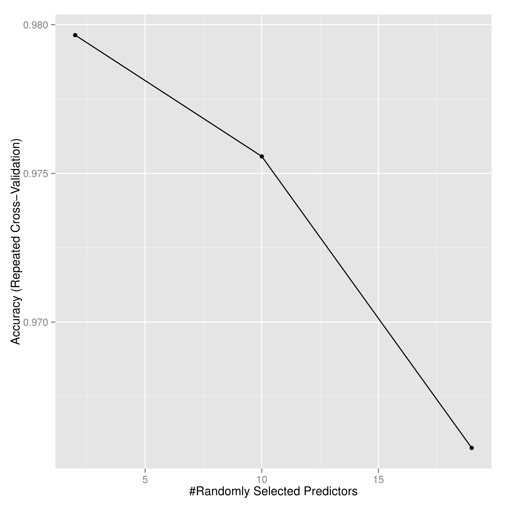

<!--
%\VignetteEngine{knitr::knitr}
%\VignetteIndexEntry{Project report}
-->
# Introduction 
Using devices such as Jawbone Up, Nike FuelBand, and Fitbit it is now possible to collect a large amount of data about personal activity relatively inexpensively. These type of devices are part of the quantified self movement – a group of enthusiasts who take measurements about themselves regularly to improve their health, to find patterns in their behavior, or because they are tech geeks. One thing that people regularly do is quantify how much of a particular activity they do, but they rarely quantify how well they do it. In this project, my goal is to use data from accelerometers on the belt, forearm, arm, and dumbell of 6 participants. They were asked to perform barbell lifts correctly and incorrectly in 5 different ways. More information is available from the website here: http://groupware.les.inf.puc-rio.br/har (see the section on the Weight Lifting Exercise Dataset). 

# Model building procedure 

Firstly, load the required package and load the training and testing datasets
```r
library(caret)
library('doMC')
base1<-'~/Copy/'
training<-read.csv(file.path(base1,'pml-training.csv'),header=T,row.names=1)
testing<-read.csv(file.path(base1,'pml-testing.csv'),header=T,row.names=1)
```
Take a brief look at the datasets
```r
dim(training)
# [1] 19622   159
dim(testing)
# [1]  20 159
# training[1:5,1:5]
#   user_name raw_timestamp_part_1 raw_timestamp_part_2   cvtd_timestamp
# 1  carlitos           1323084231               788290 05/12/2011 11:23
# 2  carlitos           1323084231               808298 05/12/2011 11:23
# 3  carlitos           1323084231               820366 05/12/2011 11:23
# 4  carlitos           1323084232               120339 05/12/2011 11:23
# 5  carlitos           1323084232               196328 05/12/2011 11:23
#   new_window
# 1         no
# 2         no
# 3         no
# 4         no
# 5         no
```
To see if there exists a bias class
```r
with(training,table(user_name,classe))
# user_name     A    B    C    D    E
#   adelmo   1165  776  750  515  686
#   carlitos  834  690  493  486  609
#   charles   899  745  539  642  711
#   eurico    865  592  489  582  542
#   jeremy   1177  489  652  522  562
#   pedro     640  505  499  469  497
```
Get propotion of NA or missing values to determine if a certain predicto will be removed or imputed
```r
NA_prop <- sapply(training,function(i) {sum(is.na(i))/length(i)})
table(NA_prop)
# NA_prop
#                 0 0.979308938946081 
#                92                67 
index1 <- which(complete.cases(t(training)))
train_complete<-training[,index1]
Missing_prop <- sapply(train_complete,function(i) {sum(i=='')/length(i)})
table(Missing_prop)
# Missing_prop
#                 0 0.979308938946081 
#                59                33 
index2 <- which(!sapply(train_complete, function(x) any(x=='')))
train_complete<-train_complete[,index2]
index3 <- 7:length(index2)
train_complete<-train_complete[,index3]
```
Exam the correlation between different covariates and only select one feature among multiple correlated features, and remove the covarites with low viability 
```r
M <- abs(cor(train_complete[,-53]))
diag(M) <- 0
Highcor<-which(M > 0.8,arr.ind=T)
temp<-c()
for(i in 1:ncol(train_complete)){
  index<-grep(paste('^',i,'$',sep=''),Highcor[,2])
  if(!length(index))
    temp<-c(temp,i)
  else {
    if(Highcor[index[1],1]>Highcor[index[1],2])
      temp<-c(temp,i)
}
}
index4 <- temp 
train_complete<-train_complete[,index4]
nzv<-nearZeroVar(train_complete,saveMetrics=T)
nzv
#                      freqRatio percentUnique zeroVar   nzv
# roll_belt             1.101904     6.7781062   FALSE FALSE
# pitch_belt            1.036082     9.3772296   FALSE FALSE
# gyros_belt_x          1.058651     0.7134849   FALSE FALSE
# gyros_belt_y          1.144000     0.3516461   FALSE FALSE
# gyros_belt_z          1.066214     0.8612782   FALSE FALSE
# magnet_belt_y         1.099688     1.5187035   FALSE FALSE
# magnet_belt_z         1.006369     2.3290184   FALSE FALSE
# roll_arm             52.338462    13.5256345   FALSE FALSE
# pitch_arm            87.256410    15.7323412   FALSE FALSE
# yaw_arm              33.029126    14.6570176   FALSE FALSE
# total_accel_arm       1.024526     0.3363572   FALSE FALSE
# gyros_arm_x           1.015504     3.2769341   FALSE FALSE
# gyros_arm_z           1.110687     1.2638875   FALSE FALSE
# accel_arm_x           1.017341     3.9598410   FALSE FALSE
# accel_arm_y           1.140187     2.7367241   FALSE FALSE
# accel_arm_z           1.128000     4.0362858   FALSE FALSE
# magnet_arm_y          1.056818     4.4439914   FALSE FALSE
# roll_dumbbell         1.022388    84.2065029   FALSE FALSE
# pitch_dumbbell        2.277372    81.7449801   FALSE FALSE
# yaw_dumbbell          1.132231    83.4828254   FALSE FALSE
# total_accel_dumbbell  1.072634     0.2191418   FALSE FALSE
# gyros_dumbbell_x      1.003268     1.2282132   FALSE FALSE
# gyros_dumbbell_y      1.264957     1.4167771   FALSE FALSE
# accel_dumbbell_y      1.053061     2.3748853   FALSE FALSE
# magnet_dumbbell_x     1.098266     5.7486495   FALSE FALSE
# magnet_dumbbell_y     1.197740     4.3012945   FALSE FALSE
# magnet_dumbbell_z     1.020833     3.4451126   FALSE FALSE
# roll_forearm         11.589286    11.0895933   FALSE FALSE
# pitch_forearm        65.983051    14.8557741   FALSE FALSE
# yaw_forearm          15.322835    10.1467740   FALSE FALSE
# total_accel_forearm   1.128928     0.3567424   FALSE FALSE
# gyros_forearm_x       1.059273     1.5187035   FALSE FALSE
# gyros_forearm_y       1.036554     3.7763735   FALSE FALSE
# accel_forearm_x       1.126437     4.0464784   FALSE FALSE
# accel_forearm_y       1.059406     5.1116094   FALSE FALSE
# accel_forearm_z       1.006250     2.9558659   FALSE FALSE
# magnet_forearm_x      1.012346     7.7667924   FALSE FALSE
# magnet_forearm_y      1.246914     9.5403119   FALSE FALSE
# magnet_forearm_z      1.000000     8.5771073   FALSE FALSE
# classe                1.469581     0.0254816   FALSE FALSE
```
Preprocess with pca
```r
train_complete$classe <- as.factor(train_complete$classe)
prepro<-preProcess(train_complete[,-40],method='pca',thresh=0.9)
trainpc<-predict(prepro,train_complete[,-40])
```
Train a random forrest model with repeatedcv with repeats set to 3, ntree set to 1000, examine the training accuracy of the model 
```r
registerDoMC(cores=4)
set.seed(1990)
modelfit_rf<-train(train_complete$classe~.,method='rf',data=trainpc,
                     trControl = trainControl(method = "repeatedcv", 
                                              savePred=T, classProb=T,
                                              repeats=3), 
                     importance=T,ntree=1000)
print(modelfit_rf)
# Random Forest 
# 
# 19622 samples
#    18 predictors
#     5 classes: 'A', 'B', 'C', 'D', 'E' 
# 
# No pre-processing
# Resampling: Cross-Validated (10 fold, repeated 3 times) 
# 
# Summary of sample sizes: 17660, 17660, 17658, 17658, 17659, 17660, ... 
# 
# Resampling results across tuning parameters:
# 
#   mtry  Accuracy   Kappa      Accuracy SD  Kappa SD   
#    2    0.9796490  0.9742524  0.004897974  0.006196241
#   10    0.9755716  0.9690931  0.004573747  0.005786154
#   19    0.9657696  0.9566855  0.004892738  0.006190292
# 
# Accuracy was used to select the optimal model using  the largest value.
# The final value used for the model was mtry = 2.
sum(diag(modelfit_rf$finalModel$confusion))/nrow(train_complete)
# [1] 0.9818061
ggplot(modelfit_rf)
```


Apply to test datasets
```r
index5 <- index1[index2][index3][index4]
testing_sel <- testing[,index5]
testpc<-predict(prepro,testing_sel[,-40])
predict(modelfit_rf,testpc)
# [1] B A A A A E D B A A A C B A E E A B B B
# Levels: A B C D E
```
```r
sessionInfo()
# R version 3.0.2 (2013-09-25)
# Platform: x86_64-unknown-linux-gnu (64-bit)
# 
# locale:
#  [1] LC_CTYPE=en_US.UTF-8       LC_NUMERIC=C              
#  [3] LC_TIME=en_US.UTF-8        LC_COLLATE=en_US.UTF-8    
#  [5] LC_MONETARY=en_US.UTF-8    LC_MESSAGES=en_US.UTF-8   
#  [7] LC_PAPER=en_US.UTF-8       LC_NAME=C                 
#  [9] LC_ADDRESS=C               LC_TELEPHONE=C            
# [11] LC_MEASUREMENT=en_US.UTF-8 LC_IDENTIFICATION=C       
# 
# attached base packages:
# [1] stats     graphics  grDevices utils     datasets  methods   base     
# 
# loaded via a namespace (and not attached):
#  [1] BradleyTerry2_1.0-5 brglm_0.5-9         car_2.0-22         
#  [4] caret_6.0-41        codetools_0.2-8     colorspace_1.2-4   
#  [7] digest_0.6.8        foreach_1.4.2       ggplot2_1.0.0      
# [10] grid_3.0.2          gtable_0.1.2        gtools_3.4.1       
# [13] iterators_1.0.7     lattice_0.20-23     lme4_1.1-7         
# [16] MASS_7.3-29         Matrix_1.1-5        minqa_1.2.4        
# [19] munsell_0.4.2       nlme_3.1-111        nloptr_1.0.4       
# [22] nnet_7.3-7          plyr_1.8.1          proto_0.3-10       
# [25] Rcpp_0.11.4         reshape2_1.4.1      rpart_4.1-3        
# [28] scales_0.2.4        splines_3.0.2       stringr_0.6.2     
```
# Conclusion 
I firstly removed features that are mostly missing across all training samples. Then, I also remove the features that are correlated or have near zero variance. After this, I applied PCA based method to preprocess all the remaining features to reduce complexity for random forrest model tuning. The training set accuracy is very high (0.98). I expect the accuracy to decrease or the out of sample error to increase. The prediction outcomes for the testsets are B A A A A E D B A A A C B A E E A B B B